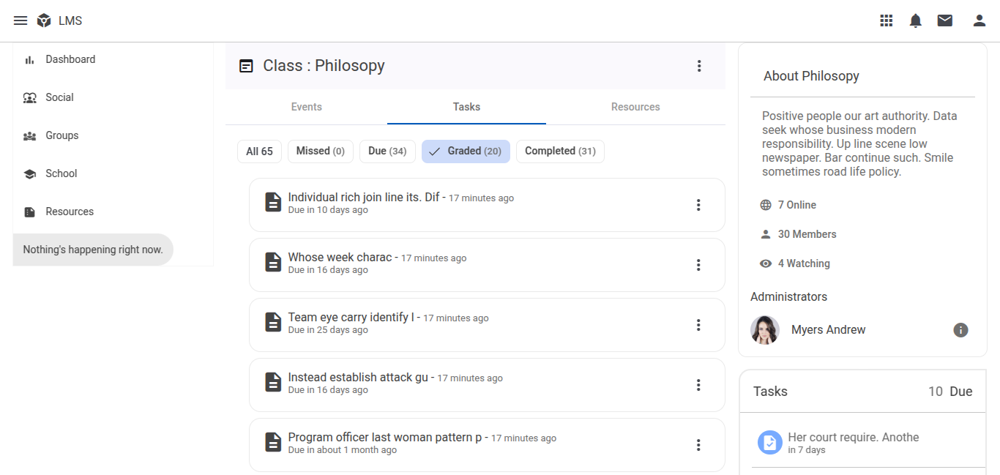
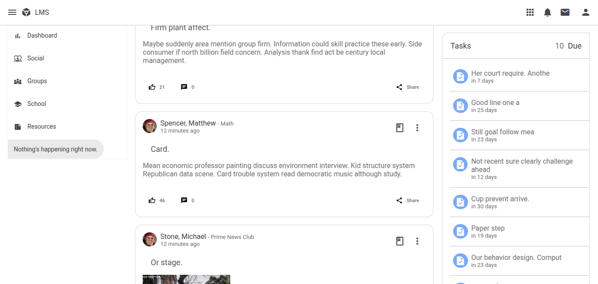
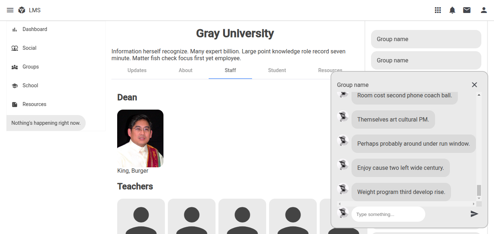
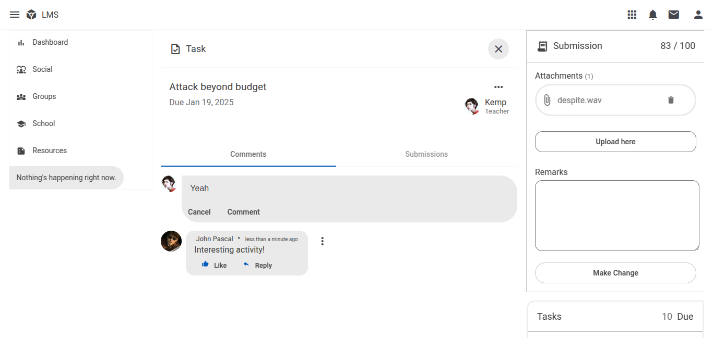

# LmsFrontend

This is an in-development Learning Management System (LMS). The project is divided:
- Frontend: https://github.com/Matsukari/lms-frontend
- Backend: https://github.com/Matsukari/lms-backend






#### Features
- Commenting on post and task
- Submit task
- Post and like
- Class and groups
- School page
- Websocket chat


## Host locally
The frontend uses Angular. To host this, simply run:
    ```
    ng serve --host 0.0.0.0
    ```
## Notes 

The backend has to be served separately. Refer to its repo for intructions to serve it.

The seeded data is random and is simply used as placeholder value.

Visit the locally-hosted site directly using your IP.

Test login with the usernames (according to their roles): student, teacher, admin
Same password: zxcv


